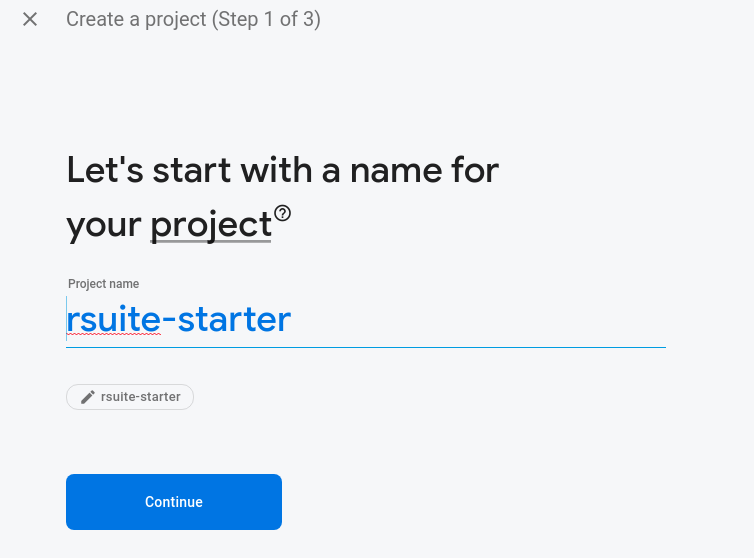
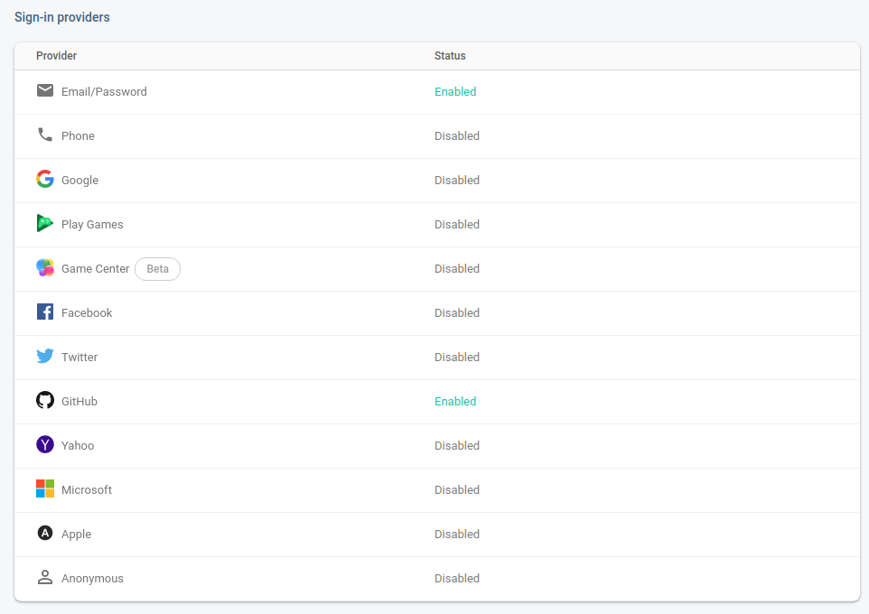
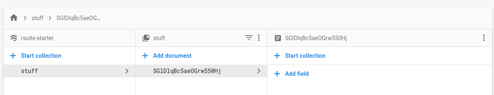
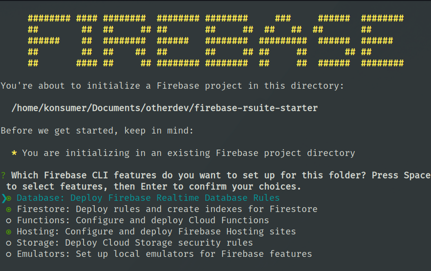
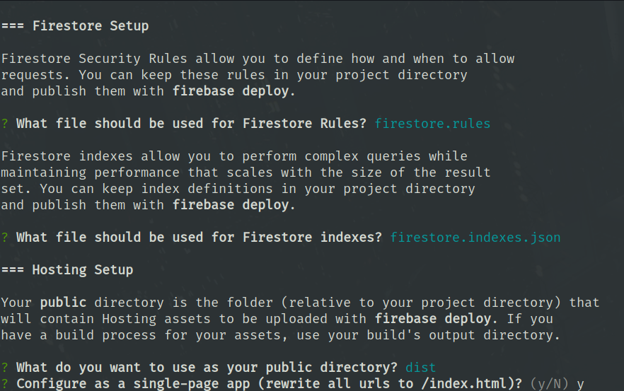

# Firebase Rsuite Starter

This is a quick-start for firebase with [react](https://reactjs.org/), [reactfire](https://github.com/FirebaseExtended/reactfire), [rsuite](https://rsuitejs.com/en/), and [parcel](https://parceljs.org/).

* [Project Console](https://console.firebase.google.com/project/rsuite-starter/overview)
* [Hosting URL](https://rsuite-starter.firebaseapp.com)


## development

```sh
npm i          # install tools and dependencies
npm start      # local dev-server
npm run deploy # deploy application on firebase
```

You'll need to make a file called `config.json` in root of project that has firebase config from [the console](https://console.firebase.google.com/u/0/project/rsuite-starter/settings/general/web).

## create your own

I like to add `./node_modules/.bin` to my path, so I can always use things in `devDependencies` quickly, but you can also install globally: `npm i -g firebase-tools`.

The CLI tool is meant to set everything up for you, but it seems to crash (as of now) creating new projects, so go to the [console](https://console.firebase.google.com/) and make a project with all the things enabled you are going to use (hosting/database/auth/etc):



Go make a new Github app [here](https://github.com/settings/developers) for Github logins.

Add authentication & setup methods including "Email & Password" and "Github":



It also seemed to help the `init` script to make an initial database and add a record:




Run `firebase init`. Turn on `Database`, `Firestore`, and `Hosting` and anything else you might need:




When it gets to the questions about hosting set the public-root to `dist` and turn on SPA:

